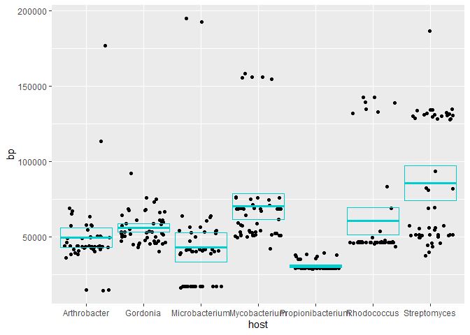

# Comparing Genetic Differences in Bacteriophages with Different Hosts.

Presentation ID: 4899

By: Beau Ayers

Biosciences Department, Minnesota State University Moorhead, 1104 7th
Avenue South, Moorhead, MN 56563 USA

Presented at the MSUM 23rd Online Student Academic Conference

Submit a survey for this presentation:
<https://mnstate.co1.qualtrics.com/jfe/form/SV_eFMAwF72JZIoeSq>

## Abstract

Bacteriophages are a type of virus that prays on a host bacterium to
reproduce itself. Each phage is specialized in targeting one type of
bacterial host. With the idea of each phage being specialized I ask, is
there a significant difference in the genes of phages with different
hosts? To discover the answer to this question, I will be using genomic
data of phages with different hosts from phages. I will use exploratory
data analysis to clean, visualize, transform, and model the data at
hand. I will use the GC%, that is how much the nucleotides G and C
appear in DNA, to find the average GC% in phages between hosts and
compare these averages. The results from this analysis could be used to
further understand phage DNA in which there are still countless
unknowns.

## Introduction

DNA is the quid essential building block for most organisms, big or
small. One such organism that uses DNA to its advantage is the
bacteriophage, or phages for short. Phages attach onto the cell wall of
its bacterial host and inserts its own DNA into the host to use its own
body to make more phages. Upon doing so, the phage’s DNA connects to the
bacteria’s own DNA which causes the bacteria to change its function to
only produce more phages. This process ultimately ends with the
bacteria’s own demise. However, this project is not looking in depth on
how this process works, but rather the relationships in the phage DNA.
There have been studies looking into the DNA similarities between
individual phages of a single host, however this project is looking more
broad. Solving this problem can further help scientists understand the
relationship between phages and bacteria as well as between phages of
different hosts. 

Image 1: Phages attacking an *E. coli* cell

## Methods

I collected the data from phagesdb by picking the first 50 phages for
each host. I took the data from the website and inserted it into an
excel document to be read into R studio by using readxl (Wickham &
Bryan, 2019). Data was collected from phagesdb (Pittsburgh Bacteriophage
Institute, 2010).

I then cleaned the data by taking the sample size, mean, standard
deviation, variance, SEM, and ci upper and lower. I then used this data
to make graphs displaying the mean and using the SEM and ci upper and
lower to make error bars. Graphs where made using ggplot (Wickham, 2016)

## Results

<!-- -->

Figure 1: The means of the GC% content of each phage categorized by the
host bacteria of the phage.

In figure 1, there is no normal distribution as the points are random on
the histogram. There isn’t much of a pattern either besides the fact
that most of the means are + or - 5 of each other.

<!-- -->

Figure 2: The means of the base pairs of each phage categorized by the
host bacteria of the phage.

In figure 2, there is no normal distribution as the points are random on
the histogram. There isn’t much of a pattern either besides the fact
that most of the means are + or - 25000 of each other except for the
mean of base pairs in *strepomyces*.

## Discussion

The results of this comparison found that there is no definitive way to
tell what phage has what host based on looking at the GC content.
However, the base pair length might have some clues, more specifically
the base pair lengths of the phages that have the hosts *Mycobacterium,
Rhodococcus,* and *Streptomyces*. The base pair lengths of the phages
that have these hosts tend to deviate heavily from the means, more
positively with the hosts *Mycobacterium* and *Rhodococcus,* and going
in both directions with the host *Streptomyces.* Seeing the differences
here leads to the idea that looking at the DNA of the phages might lead
to a better understanding of how to tell which phage infects which host
by more trivial means. If it is found that the phages with these hosts
have these definitive patterns even on a larger scale, it could help in
limiting the amount of possible host candidates.

## Literature Cited

Hadley Wickham and Jennifer Bryan (2019). readxl: Read Excel Files. R
package version 1.3.1. <https://CRAN.R-project.org/package=readxl>

H. Wickham. ggplot2: Elegant Graphics for Data Analysis. Springer-Verlag
New York, 2016.

Pittsburgh Bacteriophage Institute. (2010, April). PhagesDB.
<https://phagesdb.org/>

R version 4.0.3 (2020-10-10)

Rstudio version 1.4.1106 RStudio Team (2021). RStudio: Integrated
Development Environment for R. RStudio, PBC, Boston, MA URL
<http://www.rstudio.com/>.
